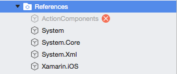
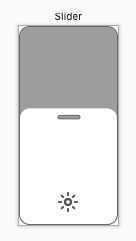

# About Action Slider

**Action Slider** is a custom slider control designed to operate like the brightness and contrast sliders built into the iPhone Control Center. The `FillPercent` property gets or sets the percentage that the slider is filled (from 0% to 100%). If the user taps or drags in the control (from top to bottom) the `FillPercent` will be adjusted accordingly and the `ValueChanged`, `Touched`, `Moved` and/or `Released` events will be raised.

**Action Slider** contains properties to customize its appearance including the border, body and fill colors. Additionally, an optional icon can be displayed at the bottom of the control. In many cases the same code used to display an **Action Slider** on one platform can be used virtually unchanged on another which not only saves time, but improves code maintainability.

# Running the Samples

Before you can successfully build and run these sample apps, you'll need to download and install the [Action Components Trial](http://appracatappra.com/products/action-components/) version from the Appracatappra website or have purchased and installed a licensed version of the components.

Next, open either the iOS or the Android version of the sample in Visual Studio and expand the **Resources** folder:



If the `ActionComponents` entry is grayed-out with a red X (as shown in the image above), right-click on it and select **Delete**. Double-Click the **Resources** folder to open the **Edit References** dialog and select the **.Net Assembly** tab:


Click the **Browse** button, navigate to where you installed the **Action Components** trial or licensed version and locate the appropriate `ActionComponents.ddl` (for either iOS or Android) and click the **OK** button. The sample will now be ready to run.

# Size and Placement

The **Action Slider** is designed to be oriented vertically (taller rather than wider), with the 0% position at the bottom of the control and the 100% at the top:



Additionally, the **Action Slider** needs to be a minimum of 50 pixels wide. Failing to honor either of these conditions will result in the control rendering and/or behaving incorrectly.

# Appearance

**Action Slider** was designed to look and function the same across platforms, however you have full control over its look and feel. **Action Slider** is fully customizable with user definable appearances for every element of its UI. You can make adjust the following properties to control the appearance:

* `BorderColor` - Defines the frame that appears on the outer edge of the control and the border around the `DragThumb` at the top of the control.
* `BodyColor` - Defines the background fill color of the control and the fill color of the `DragThumb`.
* `FillColor` - Defines the color of the percent filled area.
* `Icon` - Defines an optional icon that will be displayed at the bottom of the control.

Any change to the above properties will cause the **Action Slider** to instantly redraw and reflect the change.

# Features

**Action Slider** includes a fully documented API with comments for every feature. The ActionAlert‘s user interface is drawn with vectors and is fully resolution independent. Additionally, an **Action Slider** can be added to an app's `.storyboard` (iOS) or `.axml` (Android) file at design time or added to the UI programmatically at runtime.

Use the `FillPercent` property to get or set the amount that the control is filled from 0% to 100%. As the percent is increased, the control will fill from bottom to top.

# Responding to User Interaction

The user can interact with an **Action Slider** in one of two ways:

* **Tapping** - If the user quickly taps and releases a location inside of the control, the `FillPercent` will instantly be set to the appropriate value corresponding to the location of the tap.
* **Dragging** - If the user taps and drags up or down inside of the control, the `FillPercent` will interactively be adjusted.

Based on the type of interaction, the `ValueChanged`, `Touched`, `Moved` and/or `Released` events will be raised in response.

# iOS Example

In this example, an `ACSlider` has been added to the app's `Main.storyboard` file and exposed via the `brightnessSlider` outlet along with a `fillPercent` label:

```csharp
using ActionComponents;
…

// Set icon
brightnessSlider.Icon = UIImage.FromBundle("Brightness");

// Respond to slider change
brightnessSlider.ValueChanged += (percent) => {
	fillPercent.Text = $"{percent}%";
};
```

# Android Examples

And here is the same example **Action Alerts** created in the `OnCreate` method of an Android `Activity`:

```csharp
using ActionComponents;
…

// Access the slider
var slider = FindViewById<ACSlider>(Resource.Id.brightnessSlider);
slider.Icon = BitmapFactory.DecodeResource(Resources, Resource.Drawable.iconBrightness);

// Access text view
var brightnessLevel = FindViewById<TextView>(Resource.Id.brightnessLevel);

// Wire-up changes
slider.ValueChanged += (fillPercent) => {
	brightnessLevel.Text = $"{fillPercent}%";
};
```

# Trial Version

The Trial version of **Action Slider** is fully functional but includes a `Toast` style popup. The fully licensed version removes this popup.